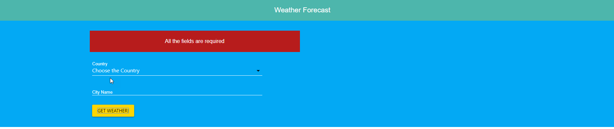

React Weather Project!

You can look for the weather of a city from some countries:

Deployed in netlify: https://distracted-volhard-7ed57b.netlify.com/

Used the weather API https://openweathermap.org/api using 'fetch' to get the data.

Some images of the project:

If a user doesnt make any selection:

If a user looks for a city that doesnt exists:

Made with ❤️ by Antonio Salazar

😗
